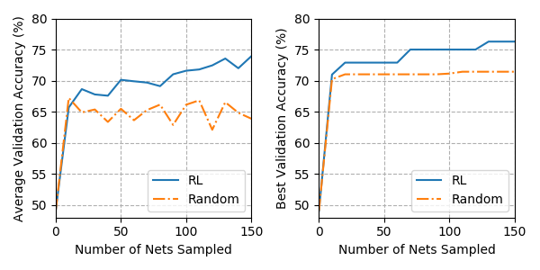

## Architecture Search and Distributed Running
To run architecture search experiments, you should first set up your 
environment for distributed running. Suppose there are a server computer
and multiple GPU clients which can be accessed on the server side 
via **ssh**. 

On the server side, you should have a configuration file **server_config** 
under the folder of **code**. An example of the **server_config** file is:
```bash
[
	["<client 1 address>", <gpu_id_0>, "<path to the **code** folder on client 1>/client.py"],
	["<client 2 address>", <gpu_id_0>, "<path to the **code** folder on client 2>/client.py"],
	["<client 2 address>", <gpu_id_1>, "<path to the **code** folder on client 2>/client.py"]
]
```
Once you make the **server_config** ready, you can run the following command under the folder of 
**code** on the server side to start the experiment:
```bash
python3 arch_search.py --setting=convnet
```


When a remote GPU, e.g. GPU_0 on client 1, is chosen 
by the server, the following command is executed
```bash
ssh <client 1 address> CUDA_VISIBLE_DEVICES=0 python3 <path to the **code** folder on client 1>/client.py 
```
Make sure that
- you can visit each client via **ssh** without password on the server side. 
[ssh-copy-id](https://www.ssh.com/ssh/copy-id) may be helpful if you have some problems with the password.
- the command "CUDA_VISIBLE_DEVICES=0 python3 <path to the **code** folder on client 1>/client.py" can be 
executed correctly on the client side.

Further details, please refer to **code/expdir_monitor/distributed.py**.

By running the code using the small network, i.e. 
**start_nets/start_net_convnet_small_C10+**, as the start point, 
you can get results like:


